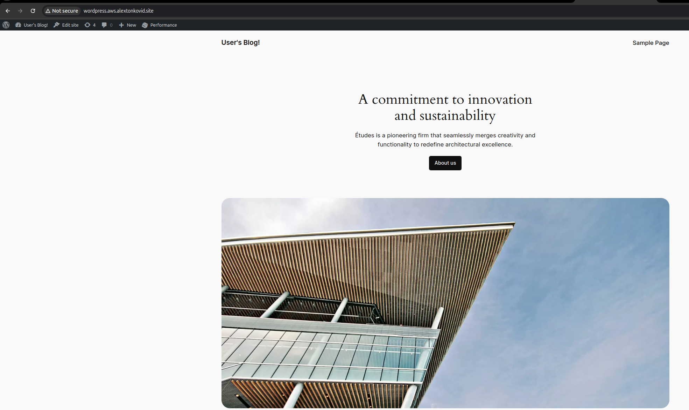
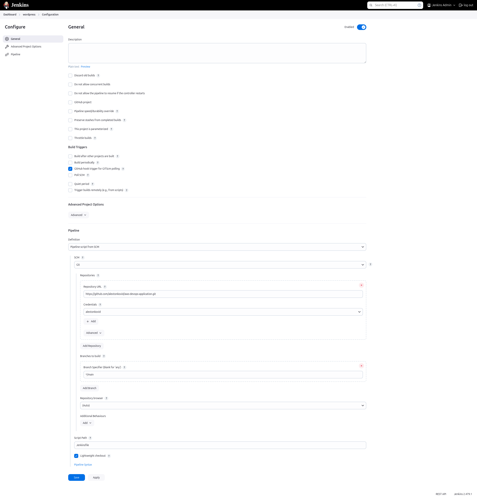
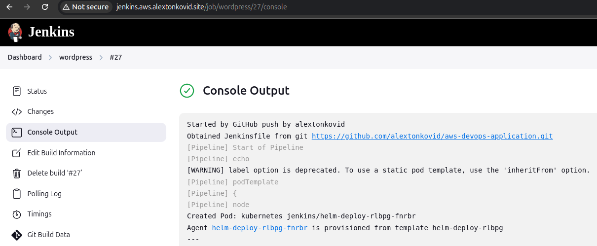

# WordPress Helm Chart Deployment

## Table of Contents
- [Overview](#overview)
- [Components](#components)
- [Prerequisites](#prerequisites)
- [Installation](#installation)
- [Chart Configuration](#chart-configuration)

- [Additional Resources](#additional-resources)
- [Jenkins Pipeline for Helm Deployment](#jenkins-pipeline-for-helm-deployment)
  - [Pipeline Structure](#pipeline-structure)
  - [Pod Template YAML](#pod-template-yaml)
  - [Pipeline Stages](#pipeline-stages)
    - [Checkout](#1-checkout)
    - [Helm Install/Upgrade](#2-helm-installupgrade)
  - [Customization](#customization)
  - [Running the Pipeline](#running-the-pipeline)


- [Evaluation Criteria](#evaluation-criteria)
   - [Helm Chart Creation (40 points)](#1-helm-chart-creation-40-points)
   - [Application Deployment (30 points)](#2-application-deployment-30-points)
   - [Repository Submission (5 points)](#3-repository-submission-5-points)
   - [Verification (5 points)](#4-verification-5-points)
   - [Additional Tasks (20 points)](#5-additional-tasks-20-points)

## Overview

This repository contains a modified Helm chart for deploying WordPress on a Kubernetes cluster. It leverages Bitnami's WordPress Helm chart, along with MariaDB for database management and Memcached for caching to improve performance.

The chart is designed to work seamlessly with Jenkins CI/CD pipelines and can be managed with Kubeapps for Helm chart deployments within Kubernetes clusters.

## Components

- **WordPress**: A popular content management system (CMS) for websites and blogs.
- **MariaDB**: A database server used to store WordPress data.
- **Memcached**: A memory caching system that stores frequently requested data for faster access.

## Prerequisites

- Kubernetes v1.23+
- Helm v3.8.0+
- Persistent Volume (PV) provisioner support
- Jenkins (for automated deployments)

## Installation

This repository includes a Jenkins pipeline file ([Jenkinsfile](../Jenkinsfile)) and webhook configuration to trigger pipeline builds automatically.

To deploy the WordPress application with a release name `my-release`, run the following command:

```bash
helm install my-release ./wordpress
```

> Note: Chart values are pre-configured to expose the WordPress application on `http` (port 30080) and `https` (port 30443) using a NodePort service.

The domain for this deployment is set to `wordpress.aws.alextonkovid.com`, managed by Terraform in a separate repository ([AWS DevOps Provision](https://github.com/alextonkovid/aws-devops-provision/blob/main/data/nginx/conf.d/wordpress.conf)).

## Chart Configuration

This chart has been customized to include:

- NodePort services on ports 30080 (HTTP) and 30443 (HTTPS)
- Automated deployment and pipeline configuration with Jenkins

To review the chart values, refer to [values.yaml](values.yaml).


## Additional Resources

For more details on Bitnami Helm charts, refer to:

- [Bitnami WordPress Container](https://github.com/bitnami/containers/tree/main/bitnami/wordpress)
- [Bitnami MariaDB Chart](https://github.com/bitnami/charts/tree/main/bitnami/mariadb)
- [Bitnami Memcached Chart](https://github.com/bitnami/charts/tree/main/bitnami/memcached)

For deployment and management of Helm charts, consider using [Kubeapps](https://kubeapps.dev/).

---

## Jenkins Pipeline for Helm Deployment

This Jenkins pipeline is designed to deploy an application using Helm. The pipeline is configured to run on a Kubernetes pod, using separate containers for Helm and kubectl. This setup allows for Helm-based deployments within a Kubernetes cluster.

## Pipeline Structure

The pipeline consists of two main stages:
1. **Checkout**: Pulls the latest code from the specified Git repository.
2. **Helm Install/Upgrade**

: Deploys or updates the Helm chart to the Kubernetes cluster.

### Pod Template YAML

The pipeline’s `kubernetes` block defines a YAML configuration that specifies the pod template. Here’s a breakdown:

```yaml
apiVersion: v1
kind: Pod
metadata:
  labels:
    some-label: helm-deploy
spec:
  containers:
    - name: helm
      image: alpine/helm:3.12.3
      command:
        - cat
      tty: true
    - name: kubectl
      image: bitnami/kubectl:latest
      command:
        - cat
      tty: true
```

This configuration uses the **`alpine/helm:3.12.3`** image for Helm and the **`bitnami/kubectl:latest`** image for kubectl.

## Pipeline Stages

### 1. Checkout

The `Checkout` stage pulls the latest code from the repository configured in Jenkins. This uses the `checkout scm` step to ensure the latest changes are available for deployment.

### 2. Helm Install/Upgrade

In the `Helm Install/Upgrade` stage:
- The Helm container (`container('helm')`) runs a `helm upgrade --install` command.
- The release name is set to `wordpress`, and the Helm chart path is `./wordpress` (relative to the repository root).
- The namespace is defined as `rsschool-wordpress`. If the namespace doesn’t exist, it is created by Helm using the `--create-namespace` flag.

```sh
helm upgrade --install ${releaseName} ${chartPath} --namespace ${namespace} --create-namespace
```

## Customization

- **Release Name**: Modify `releaseName` if deploying a different application.
- **Chart Path**: Update `chartPath` with the path to your Helm chart.
- **Namespace**: Change `namespace` as needed to target a specific namespace in your Kubernetes cluster.

## Running the Pipeline

1. Commit and push this Jenkins pipeline script to your repository.
2. Configure the Jenkins job to point to the repository.
3. Run the pipeline, and Jenkins will deploy the application using Helm.


## Evaluation Criteria

### 1. Helm Chart Creation (40 points)

- A custom Helm chart for the WordPress application has been created.
  - [Link to Helm Chart](https://github.com/alextonkovid/aws-devops-application/tree/main/wordpress)

### 2. Application Deployment (30 points)

- The application has been successfully deployed using the Helm chart and is accessible from the internet.
  

### 3. Repository Submission (5 points)

- A new repository is created to contain both the WordPress application and Helm chart.
  - [Link to Helm Chart Repository](https://github.com/alextonkovid/aws-devops-application/tree/main/wordpress)

### 4. Verification (5 points)
<details>
  <summary>**Click to view Jenkins Log**</summary>

  ### Jenkins pipeline log
  ```code
   > git rev-parse --resolve-git-dir /home/jenkins/agent/workspace/wordpress/.git # timeout=10
 > git config remote.origin.url https://github.com/alextonkovid/aws-devops-application.git # timeout=10
Fetching upstream changes from https://github.com/alextonkovid/aws-devops-application.git
 > git --version # timeout=10
 > git --version # 'git version 2.39.2'
using GIT_SSH to set credentials 
 > git fetch --tags --force --progress -- https://github.com/alextonkovid/aws-devops-application.git +refs/heads/*:refs/remotes/origin/* # timeout=10
 > git rev-parse refs/remotes/origin/main^{commit} # timeout=10
 > git config core.sparsecheckout # timeout=10
 > git checkout -f 89ea2ed097f557c126ab2bebc12148a2ff446b74 # timeout=10
+ helm list -A
NAME       	NAMESPACE  	REVISION	UPDATED                                	STATUS  	CHART                        	APP VERSION
jenkins    	jenkins    	1       	2024-11-09 11:12:43.016884167 +0000 UTC	deployed	jenkins-5.7.12               	2.479.1    
traefik    	kube-system	1       	2024-11-09 11:13:13.34548714 +0000 UTC 	deployed	traefik-27.0.201+up27.0.2    	v2.11.10   
traefik-crd	kube-system	1       	2024-11-09 11:13:10.703793095 +0000 UTC	deployed	traefik-crd-27.0.201+up27.0.2	v2.11.10   
+ helm install wordpress ./wordpress
NAME: wordpress
LAST DEPLOYED: Sat Nov  9 16:22:22 2024
NAMESPACE: jenkins
STATUS: deployed
REVISION: 1
TEST SUITE: None
NOTES:
CHART NAME: wordpress
CHART VERSION: 23.1.26
APP VERSION: 6.6.2

** Please be patient while the chart is being deployed **

Your WordPress site can be accessed through the following DNS name from within your cluster:

    wordpress.jenkins.svc.cluster.local (port 80)

To access your WordPress site from outside the cluster follow the steps below:

1. Get the WordPress URL by running these commands:

   export NODE_PORT=$(kubectl get --namespace jenkins -o jsonpath="{.spec.ports[0].nodePort}" services wordpress)
   export NODE_IP=$(kubectl get nodes --namespace jenkins -o jsonpath="{.items[0].status.addresses[0].address}")
   echo "WordPress URL: http://$NODE_IP:$NODE_PORT/"
   echo "WordPress Admin URL: http://$NODE_IP:$NODE_PORT/admin"

2. Open a browser and access WordPress using the obtained URL.

3. Login with the following credentials below to see your blog:

  echo Username: user
  echo Password: $(kubectl get secret --namespace jenkins wordpress -o jsonpath="{.data.wordpress-password}" | base64 -d)

WARNING: There are "resources" sections in the chart not set. Using "resourcesPreset" is not recommended for production. For production installations, please set the following values according to your workload needs:
  - resources
+info https://kubernetes.io/docs/concepts/configuration/manage-resources-containers/
[Pipeline] }
[Pipeline] // script
[Pipeline] }
[Pipeline] // container
[Pipeline] }
[Pipeline] // stage
[Pipeline] }
[Pipeline] // withEnv
[Pipeline] }
[Pipeline] // node
[Pipeline] }
[Pipeline] // podTemplate
[Pipeline] End of Pipeline
Finished: SUCCESS
  ```
</details>
- The application is verified to be running and accessible.


### 5. Additional Tasks (20 points)

- **CI/CD Pipeline (10 points)**: A CI/CD pipeline automates the deployment of the application.
  
  

- **Documentation (10 points)**: This README file provides comprehensive documentation on the setup and deployment process.