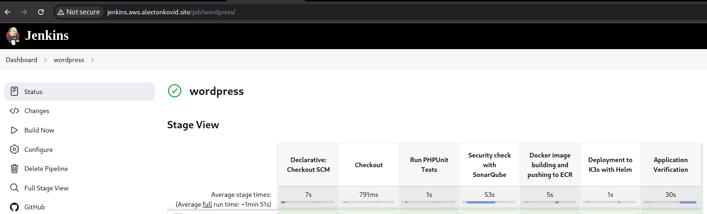
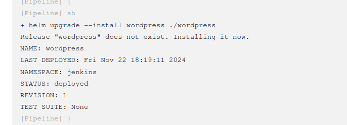
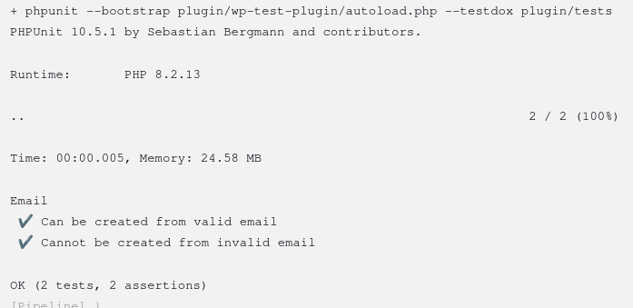
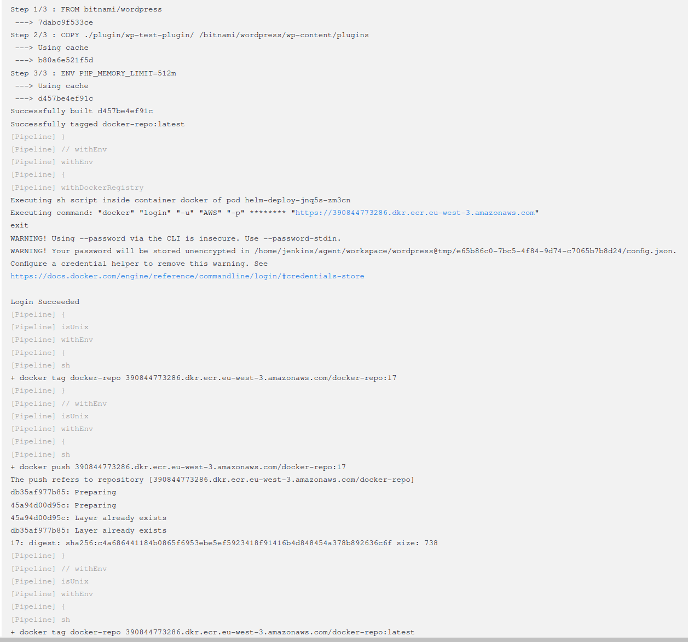
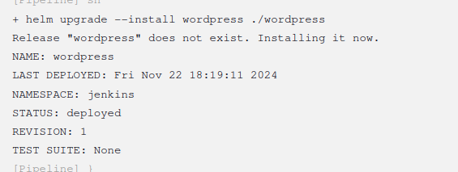
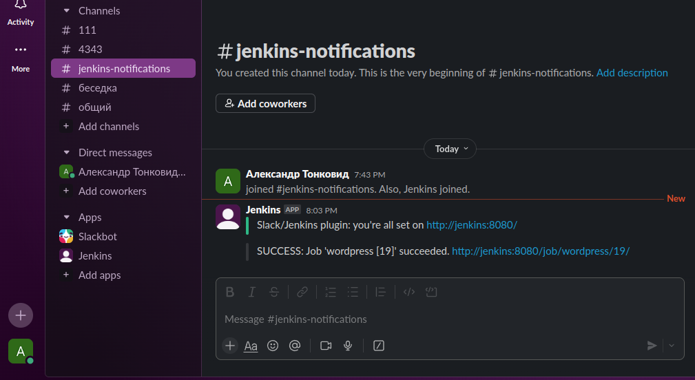

#WordPress Deployment and Testing with Kubernetes and Helm

This repository contains a Jenkins pipeline configuration to automate the deployment of a WordPress application. The pipeline includes the following stages:

1. **Code Checkout**: Clones the repository from the source control system.
2. **Unit Testing**: Runs PHPUnit tests for the WordPress plugin.
3. **Security Check**: Analyzes the code using SonarQube for security and quality assurance.
4. **Docker Image Build and Push**: Builds a Docker image and pushes it to AWS Elastic Container Registry (ECR).
5. **Helm Deployment**: Deploys the WordPress application to a K3s cluster using Helm.
6. **Application Verification**: Verifies that the application is accessible after deployment.
7. **Notifications**: Sends notifications via Slack on success or failure.

---

## Pipeline Details

### Kubernetes Pod Configuration
The pipeline runs on a Kubernetes pod with the following containers:
- **PHP**: For running PHPUnit tests (`jitesoft/phpunit:8.2`).
- **Helm**: For deploying the application using Helm (`alpine/helm:3.12.3`).
- **Kubectl**: For Kubernetes cluster operations (`bitnami/kubectl:latest`).
- **Docker**: For building and pushing Docker images (`docker:20.10`).

The pod also mounts the Docker socket for container builds.

### Environment Variables
- `ECR_REPO`: AWS ECR repository (`390844773286.dkr.ecr.eu-west-3.amazonaws.com/docker-repo`).
- `IMAGE_NAME`: The Docker image name (`wordpress`).
- `REGION`: AWS region (`eu-west-3`).

---

## Pipeline Stages

### 1. Checkout
Clones the repository using the Jenkins `checkout scm` command.

### 2. Run PHPUnit Tests
Runs PHPUnit tests within the `php` container:
```bash
phpunit --bootstrap plugin/wp-test-plugin/autoload.php --testdox plugin/tests
```

### 3. Security Check with SonarQube
Analyzes the code for quality and security using SonarQube:
```bash
sonar-scanner -Dsonar.sources=$WORKSPACE/plugin
```

### 4. Docker Image Build and Push
Builds the Docker image and pushes it to AWS ECR:
```groovy
app = docker.build("docker-repo")
docker.withRegistry('https://390844773286.dkr.ecr.eu-west-3.amazonaws.com', 'ecr:eu-west-3:aws') {
    app.push("${env.BUILD_NUMBER}")
    app.push("latest")
}
```

### 5. Deployment to K3s with Helm
Deploys the WordPress application using Helm:
```bash
helm upgrade --install wordpress ./wordpress
```

### 6. Application Verification
Verifies the application by checking its accessibility:
```bash
curl -LI http://wordpress.aws.alextonkovid.site/ --fail --silent --show-error || exit 1
```

### 7. Slack Notifications
Sends success or failure notifications to a Slack channel:
- **Success**: Job succeeded.
- **Failure**: Job failed.

---

## Prerequisites
- Jenkins with Kubernetes plugin configured.
- AWS credentials for accessing ECR.
- SonarQube configured with the required credentials.
- Slack integration set up in Jenkins.

---

## Notes
- Ensure that the Kubernetes cluster is properly configured for Jenkins to run the pipeline.
- Update the Helm chart path (`./wordpress`) and release name (`wordpress`) as necessary.
- Modify environment variables and Slack settings according to your setup.

---

## Submission

- Provide a PR with the application, Helm chart, and Jenkinsfile in a repository.
- Ensure that the pipeline runs successfully and deploys the application to the K8s cluster.


- Provide a README file documenting the pipeline setup and deployment process.

## Evaluation Criteria (100 points for covering all criteria)

1. **Pipeline Configuration (40 points)**

   - A Jenkins pipeline is configured and stored as a Jenkinsfile in the main git repository.
   - The pipeline includes the following steps:
     - Application build (not nessesary wiSth wordpress)
     - Unit test execution
					
     - Security check with SonarQube
					
     - Docker image building and pushing to ECR (manual trigger)
					
     - Deployment to K8s cluster with Helm (dependent on the previous step)
					
2. **Artifact Storage (20 points)**

   - Built artifacts (Dockerfile, Helm chart) are stored in git and ECR (Docker image). 

[link to chart](https://github.com/alextonkovid/aws-devops-application/blob/task_6/wordpress/Chart.yaml)
3. **Repository Submission (5 points)**

   - A repository is created with the application, 
		 [Helm chart](https://github.com/alextonkovid/aws-devops-application/blob/task_6/wordpress/Chart.yaml), and
			[Jenkinsfile](https://github.com/alextonkovid/aws-devops-application/blob/task_6/Jenkinsfile) .

4. **Verification (5 points)**

   - The pipeline runs successfully and deploys the application to the K8s cluster.


5. **Additional Tasks (30 points)**
   - **Application Verification (10 points)**
     - Application verification is performed (e.g., curl main page, send requests to API, smoke test).
					
   - **Notification System (10 points)**
     - A notification system is set up to alert on pipeline failures or successes.
					
   - **Documentation (10 points)**
     - The pipeline setup and deployment process, are documented in a README file.